<div align="center">

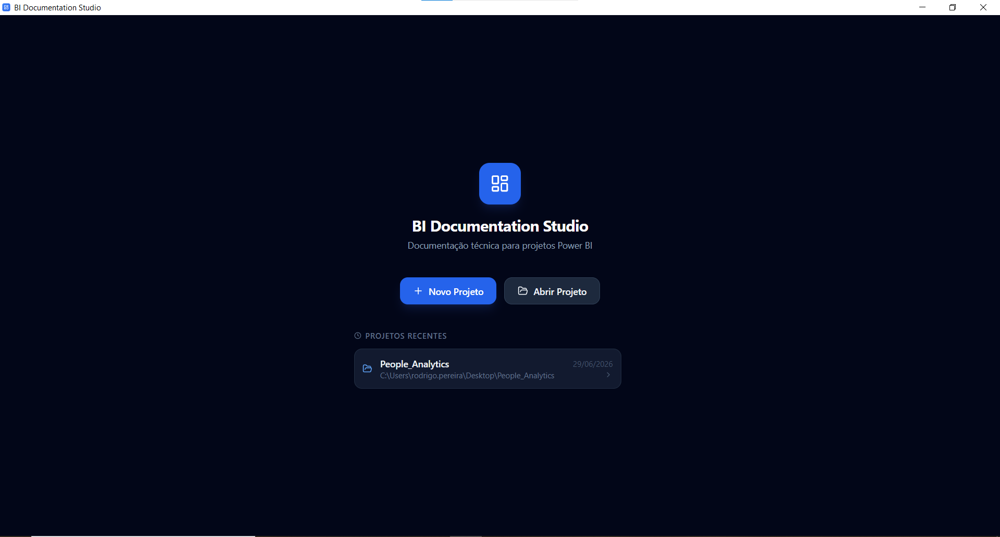

<br><br>

# BI Documentation Studio

**Ferramenta desktop para documentação técnica de projetos Power BI.**  
Cadastre KPIs, Queries, Medidas DAX, Relacionamentos e Páginas através de uma interface estruturada  
e gere documentação completa em Markdown e HTML automaticamente.

<br>

[](https://tauri.app)
[](https://react.dev)
[](https://www.typescriptlang.org)
[](https://tailwindcss.com)
[](https://www.rust-lang.org)
[](https://www.microsoft.com/windows)
[](https://github.com)
[](https://github.com)

<br>

[📸 Ver Screenshots](#-screenshots) · [✨ Funcionalidades](#-funcionalidades) · [🗂️ Projeto de Exemplo](#️-projeto-de-exemplo) · [📄 Exportação](#-exportação) · [🛠️ Stack Técnica](#️-stack-técnica)

</div>

---

## O Problema

Em projetos de Business Intelligence, a documentação técnica raramente existe — e quando existe, está dispersa entre:

- Arquivos Word e planilhas desatualizados
- Notion, Confluence ou wikis internas sem padrão
- Comentários informais em reuniões
- **Conhecimento tácito da equipe** que vai embora com o analista

Isso gera um ciclo custoso: cada novo profissional que chega no projeto gasta semanas descobrindo o que cada medida DAX faz, de onde vêm os dados, quais são as regras de negócio e por que aquela query tem aquele filtro específico.

**BI Documentation Studio** resolve esse problema com uma abordagem direta: o analista preenche formulários estruturados e a ferramenta gera automaticamente toda a documentação técnica do projeto.

---

## ✨ Funcionalidades

### Cadastro estruturado de todas as camadas do BI

Cada seção é projetada para capturar exatamente o que analistas, desenvolvedores e gestores precisam saber sobre aquele componente:

| Seção | O que documenta |
|---|---|
| **Projeto** | Informações gerais, responsável, fontes de dados, objetivo, contexto e melhorias futuras planejadas |
| **KPIs** | Fórmula, o que mede, objetivo/meta, escopo detalhado (o que entra, o que não entra, exceções), regras temporais, fonte dos dados e responsável pela validação |
| **Queries** | Fonte de dados (SQL Server, Excel, Power Query, DAX), código completo SQL/M, transformações aplicadas e colunas com tipo e descrição |
| **Relacionamentos** | Cardinalidade, direção do filtro, status (ativo/inativo) e suporte explícito a `USERELATIONSHIP` com badge de identificação |
| **Medidas DAX** | Fórmula completa, dependências entre medidas, KPIs relacionados, instruções de validação e query SQL opcional para cruzamento com a fonte |
| **Páginas** | Captura de tela da página, visuais com tipo/objetivo/campos/referências, filtros de página e filtros de relatório com identificação visual de escopo global |
| **Glossário** | Termos de negócio ordenados alfabeticamente |

### Exportação automática profissional

- **Markdown** — gera `README.md` com sumário navegável, referências cruzadas resolvidas (IDs → links entre KPIs, Medidas, Queries e Visuais), imagens incorporadas, blocos colapsáveis para código longo e snapshot histórico com timestamp
- **HTML / PDF** — documento interativo com sidebar de navegação fixa, scroll spy, syntax highlight para DAX/SQL, estilos otimizados para impressão e botão flutuante "Imprimir / Exportar PDF"

### Gerenciamento de projetos

- Múltiplos projetos com histórico de recentes e opção de remoção individual
- Persistência **100% local** via `documentacao.json` — sem servidor, sem banco de dados, sem internet
- Controle visual de alterações não salvas (indicador âmbar na barra superior)
- Atalho `Ctrl+S` com feedback visual de confirmação
- Sistema de imagens com **nomenclatura padronizada por slug** (`img_<pagina>_pagina.ext` e `img_<pagina>_<visual>_visual.ext`)
- Renomeação automática de arquivos de imagem ao alterar título da página ou nome do visual

### Qualidade e produtividade

- **Indicador de qualidade por seção** na sidebar — mostra `X/Y` itens completos com código de cor (verde ✅ / âmbar ⚠️ / cinza ○)
- **Busca global** em tempo real por nome de KPIs, Queries, Medidas, Relacionamentos, Visuais e termos do Glossário
- **Duplicar item** com um clique em qualquer seção — útil para medidas variantes (ex: `Turnover`, `Turnover Trimestre`, `Turnover Semestral`)

---

## 📸 Screenshots

### Gerenciador de Projetos
> Tela inicial com acesso a projetos recentes, abertura de projetos existentes e criação de novos.


---

### Informações do Projeto
> Formulário estruturado com identificação, objetivo, fontes de dados, observações e campo de melhorias futuras planejadas.

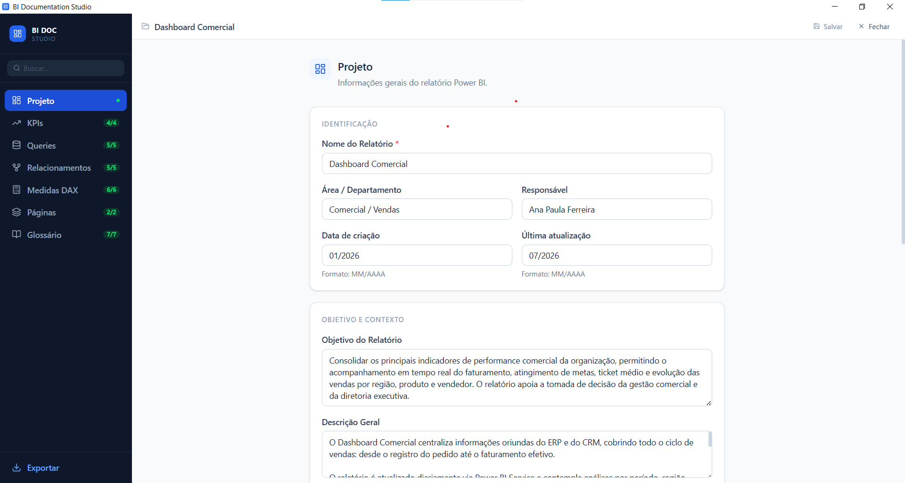

---

### KPIs — Visão da seção
> Lista de KPIs cadastrados com badge de tipo de visual, fórmula e indicador de responsável pela validação.

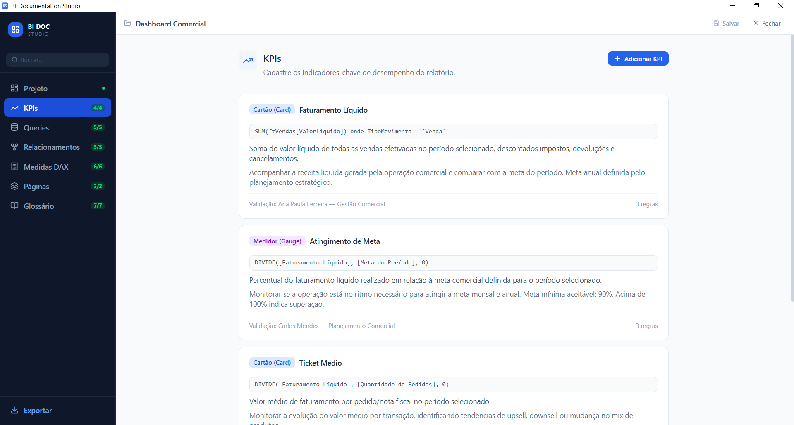

### KPIs — Formulário de cadastro
> Formulário completo com 5 grupos de campos: identificação, o que calcula, escopo do cálculo, temporalidade e origem/validação.

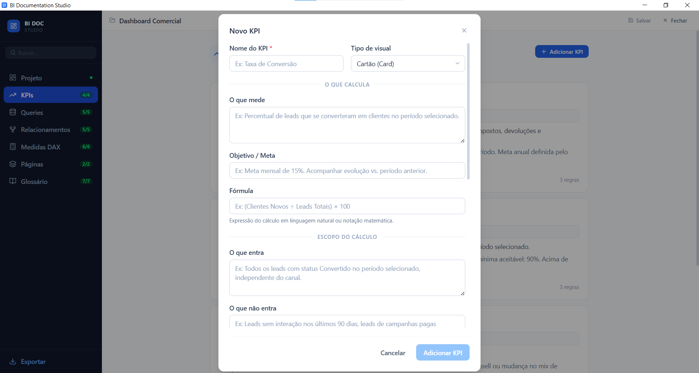

---

### Queries / Tabelas — Visão da seção
> Lista de queries com indicação da fonte de dados, contagem de colunas e transformações.

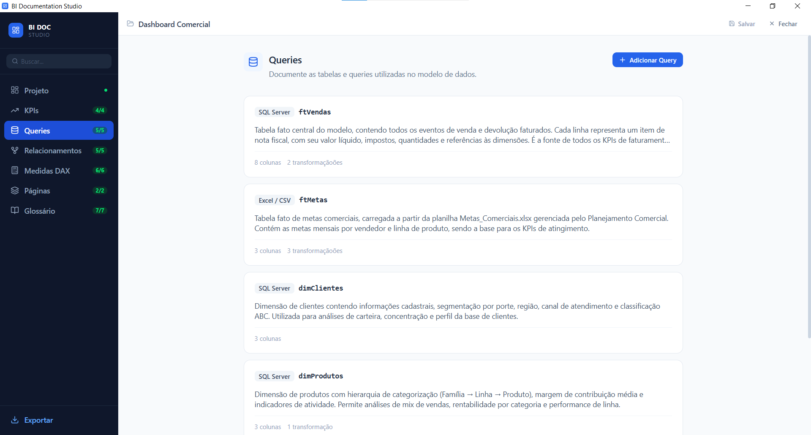

### Queries / Tabelas — Formulário de cadastro
> Formulário com editor de código SQL/M com tema escuro, lista de transformações e editor de colunas com tipo e descrição.

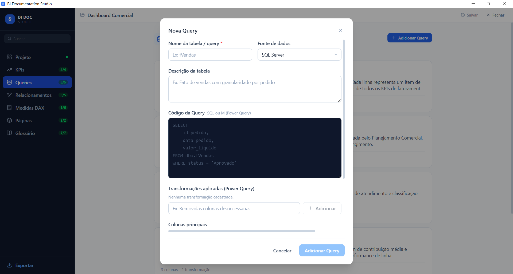

---

### Relacionamentos — Visão da seção
> Cards no estilo Power BI: `Tabela[Coluna] → Tabela[Coluna]` com badges de cardinalidade, direção, status e indicador de `USERELATIONSHIP`.

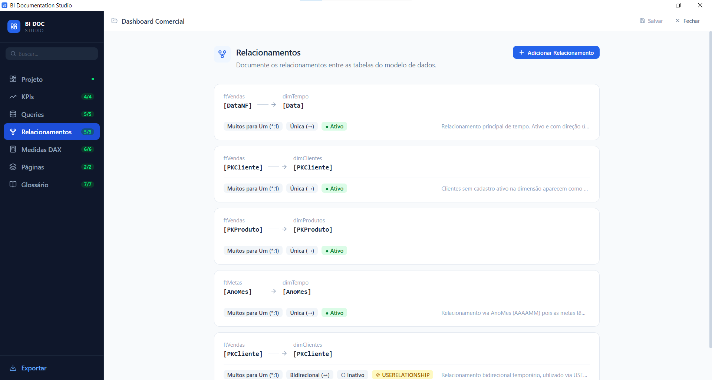

### Relacionamentos — Formulário de cadastro
> Formulário com campos para tabelas, colunas, cardinalidade, direção e toggle para relacionamento temporário via USERELATIONSHIP.

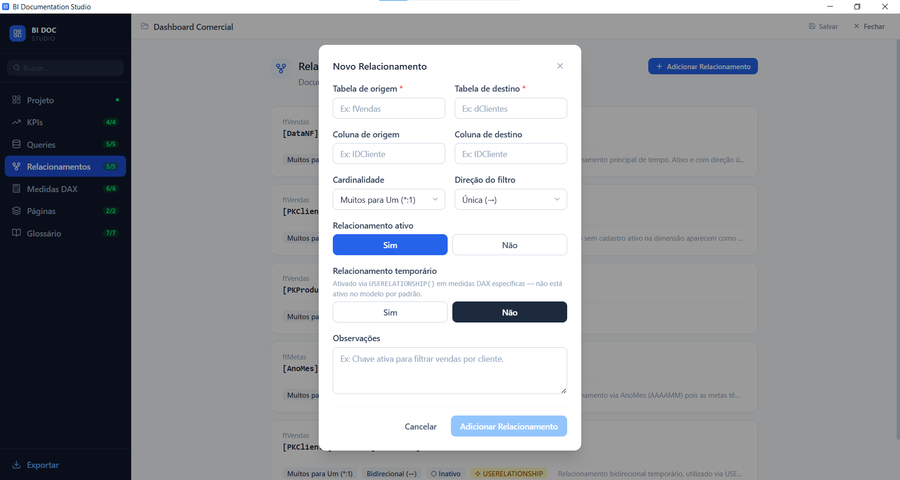

---

### Medidas DAX — Visão da seção
> Cards com preview da primeira linha da fórmula, dependências entre medidas e KPIs vinculados.

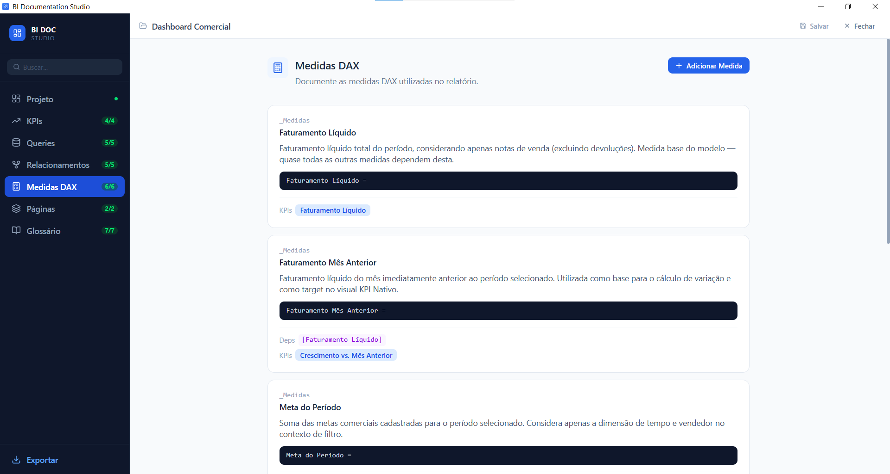

### Medidas DAX — Formulário de cadastro
> Editor DAX com tema escuro, seleção de dependências entre medidas, KPIs relacionados e campo de query de validação SQL.

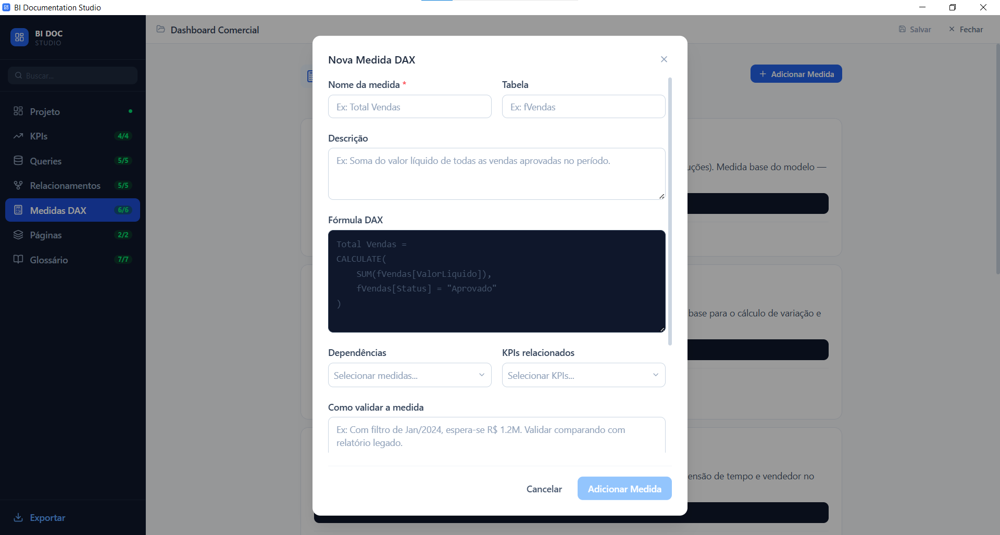

---

### Páginas — Visão da seção
> Cards de página com miniatura da captura de tela, contagem de visuais e filtros.

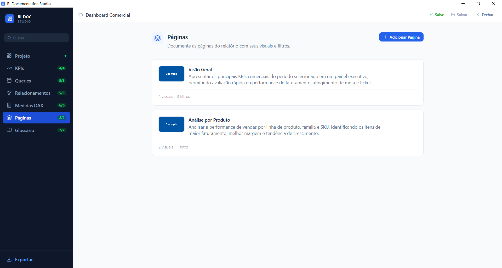

### Páginas — Formulário de cadastro
> Modal com upload de imagem da página, editor inline de visuais (sem modal aninhado) e editor de filtros com distinção de escopo (Relatório / Página / Slicer).

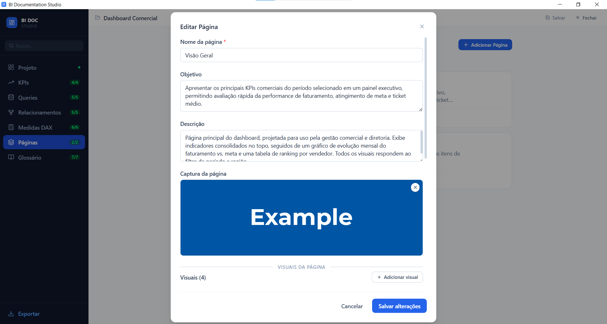

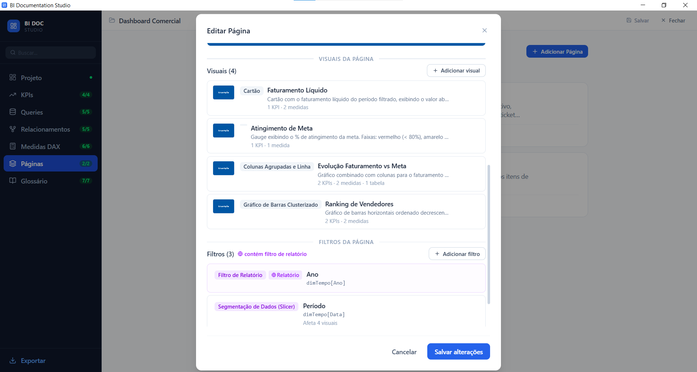

---

### Glossário
> Lista ordenada alfabeticamente com cadastro de termos de negócio e suas definições.

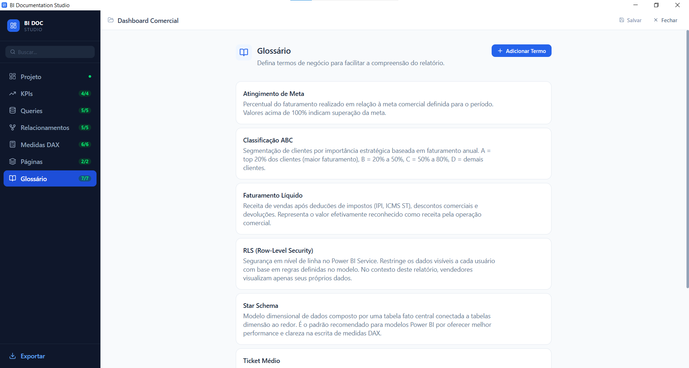

---

### Exportar
> Painel com resumo estatístico do projeto e opções de exportação para Markdown e HTML/PDF.

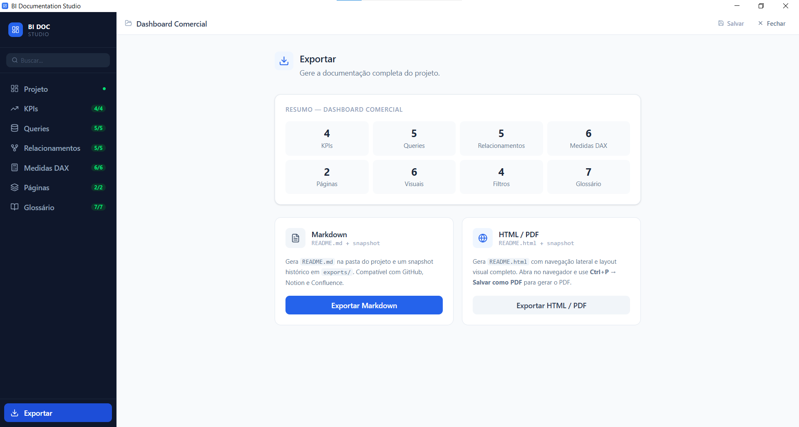

---

### HTML gerado — Documento interativo
> Resultado da exportação HTML com sidebar de navegação fixa, scroll spy, syntax highlight e botão flutuante de impressão/PDF.

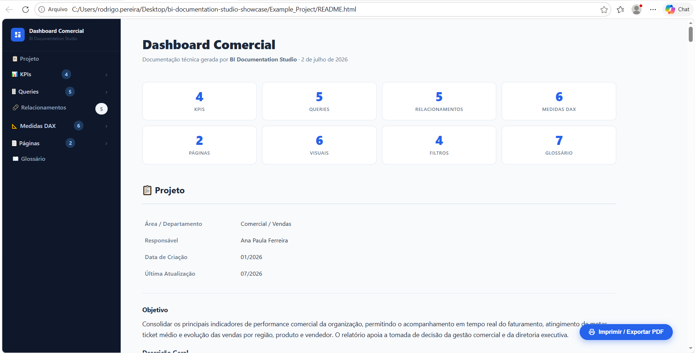

---

## 🗂️ Projeto de Exemplo

O repositório inclui um projeto de exemplo completo — **Dashboard Comercial** — documentado integralmente com o BI Documentation Studio. Ele demonstra o resultado final de uma documentação real com todos os campos preenchidos em todas as seções.

### Estrutura de um projeto documentado

```
Example_Project/
│
├── documentacao.json              ← fonte de verdade (todos os dados cadastrados)
├── README.md                      ← markdown gerado automaticamente pelo app
├── README.html                    ← HTML interativo gerado automaticamente pelo app
│
├── imagens/
│   ├── paginas/
│   │   ├── img_visao-geral_pagina.png
│   │   └── img_analise-por-produto_pagina.png
│   └── visuais/
│       ├── img_visao-geral_faturamento-liquido_visual.png
│       ├── img_visao-geral_atingimento-de-meta_visual.png
│       ├── img_visao-geral_evolucao-faturamento-vs-meta_visual.png
│       └── img_visao-geral_ranking-de-vendedores_visual.png
│
└── exports/
    └── historico-dashboard-comercial-01-07-2026_10-53/
        ├── documentacao-01-07-2026_10-53.json    ← snapshot versionado do JSON
        ├── dashboard-comercial-01-07-2026_10-53.md
        ├── dashboard-comercial-01-07-2026_10-53.html
        └── imagens/                               ← cópia das imagens do momento
            ├── paginas/
            └── visuais/
```

> Cada exportação gera uma pasta de snapshot com data e hora — múltiplas exportações no mesmo dia criam pastas distintas, cada uma **autocontida com as imagens do momento**, permitindo abrir e visualizar versões antigas da documentação a qualquer tempo.

### Conteúdo do projeto de exemplo

| Seção | Itens documentados |
|---|---|
| **KPIs** | Faturamento Líquido, Atingimento de Meta, Ticket Médio, Crescimento vs. Mês Anterior |
| **Queries** | ftVendas (SQL Server), ftMetas (Excel), dimClientes, dimProdutos, dimTempo (Power Query) |
| **Relacionamentos** | 5 relacionamentos — incluindo 1 bidirecional temporário via `USERELATIONSHIP` |
| **Medidas DAX** | Faturamento Líquido, Faturamento Mês Anterior, Meta do Período, % Atingimento, Ticket Médio, Faturamento YTD |
| **Páginas** | Visão Geral (4 visuais + 3 filtros), Análise por Produto (2 visuais + 1 filtro) |
| **Glossário** | 7 termos (Faturamento Líquido, Ticket Médio, Atingimento de Meta, Classificação ABC, YTD, RLS, Star Schema) |

📁 [Acessar projeto de exemplo](Example_Project/)  
📄 [Ver README.md gerado](Example_Project/README.md)  
🌐 [Ver documentacao.json](Example_Project/documentacao.json)

---

## 📄 Exportação

### Markdown

O `README.md` gerado inclui:

- **Sumário navegável** com links para todas as seções, KPIs, queries agrupadas por tipo (Fato / Dimensão / Outras) e medidas DAX
- **Referências cruzadas resolvidas** — IDs são convertidos em links clicáveis entre entidades (ex: uma Medida DAX linka para os KPIs que alimenta e para os Visuais que a utilizam; um KPI mostra quais Medidas o calculam)
- **Imagens** de páginas e visuais incorporadas com caminhos relativos funcionando tanto no `README.md` raiz quanto nos snapshots
- **Blocos colapsáveis** `<details>` para código SQL/M extenso, fórmulas DAX e queries de validação — documentação limpa sem sacrificar completude
- **Snapshot histórico** com sufixo `dd-MM-yyyy_HH-mm` em `exports/` — múltiplas exportações no mesmo dia geram pastas distintas, cada uma autocontida com JSON + Markdown + imagens

### HTML / PDF

O `README.html` gerado inclui:

- **Sidebar fixa** com navegação completa por seção, queries agrupadas e scroll spy — item ativo destacado automaticamente conforme a rolagem
- **Queries agrupadas** visualmente: 🟦 Tabelas Fato / 🟩 Tabelas Dimensão / ⬜ Outras
- **Syntax highlight** para DAX e SQL com tema escuro
- **Blocos colapsáveis** para código longo — `📄 Ver código SQL/M`, `📐 Ver fórmula DAX`, `🧪 Query de Validação`, `🔗 Referências`
- **Imagens** de páginas (70% da largura, centralizadas, `object-fit: contain`) e visuais preservando a proporção original
- **Botão flutuante** "Imprimir / Exportar PDF" que abre o diálogo nativo de impressão do navegador com estilos `@media print` otimizados (sidebar oculta, quebras de página inteligentes, código formatado para impressão)

---

## 🛠️ Stack Técnica

| Camada | Tecnologias |
|---|---|
| **Interface** | React 19, TypeScript 5, Tailwind CSS 4, Radix UI |
| **Desktop** | Tauri v2 (Rust) |
| **Estado** | Zustand + Immer |
| **Persistência** | JSON local — sem banco de dados, sem servidor, sem internet |
| **Build** | Vite 8 |
| **CI/CD** | GitHub Actions |
| **Exportação** | Geradores TypeScript próprios (`markdownGenerator.ts` e `htmlGenerator.ts`) |

### Arquitetura do projeto

```
bi-documentation-studio/
│
├── src/
│   ├── components/
│   │   ├── common/          ← Button, Input, Modal, Card, Badge, MultiSelect...
│   │   ├── layout/          ← AppShell, Sidebar, TopBar, SectionHeader
│   │   ├── sections/        ← ProjetoSection, KpisSection, QueriesSection...
│   │
│   ├── generators/
│   │   ├── markdownGenerator.ts   ← gera README.md com referências cruzadas
│   │   └── htmlGenerator.ts       ← gera HTML interativo com sidebar e print
│   │
│   ├── hooks/
│   │   ├── useProject.ts          ← ciclo de vida do projeto
│   │   ├── useAutoUpdate.ts       ← verificação e instalação de updates
│   │   └── useSaveShortcut.ts     ← Ctrl+S
│   │
│   ├── models/
│   │   ├── schema.ts              ← interfaces TypeScript do documentacao.json
│   │   ├── enums.ts               ← labels e opções de select
│   │   └── app.ts                 ← tipos de estado do app
│   │
│   ├── services/
│   │   ├── fileService.ts         ← leitura/escrita de arquivos via Tauri FS
│   │   ├── projectService.ts      ← criar/abrir projetos
│   │   ├── exportService.ts       ← exportar Markdown e HTML + snapshots
│   │   ├── imageService.ts        ← importar, renomear e resolver URLs de imagens
│   │   └── updateService.ts       ← verificar e instalar atualizações
│   │
│   └── store/
│       ├── useDocStore.ts         ← estado do documento (Zustand + Immer)
│       └── useAppStore.ts         ← estado do app com persistência local
│
├── src-tauri/
│   ├── capabilities/default.json  ← permissões (fs, dialog, updater, process)
│   ├── icons/                     ← ícones do app para todas as plataformas
│   └── src/lib.rs                 ← registro dos plugins Tauri
│
└── .github/workflows/
    ├── build-windows.yml          ← build de validação a cada push em main
    └── release.yml                ← build assinado + GitHub Release via tag v*
```

---

## 📦 Status

```
V1.0 — Lançada ✅
──────────────────────────────────────────────────────
Gerenciamento de múltiplos projetos ........... ✅
Cadastro estruturado — 7 seções ............... ✅
Sistema de imagens com slug padronizado ........ ✅
Controle de alterações não salvas .............. ✅
Exportação Markdown com referências cruzadas ... ✅
Exportação HTML interativo com sidebar ......... ✅
Geração de PDF via impressão do navegador ...... ✅
Snapshots históricos com imagens ............... ✅
Busca global em tempo real ..................... ✅
Indicador de qualidade por seção ............... ✅
Duplicar itens .................................. ✅

Roadmap V2
──────────────────────────────────────────────────────
Atualização automática via GitHub Releases .... 🔜 
Diagrama visual de relacionamentos ............ 🔜
Templates de documentação ..................... 🔜
Comparação entre versões exportadas ........... 🔜
Dashboard de abertura com resumo do projeto ... 🔜
```

---

## 💡 Contexto

Desenvolvido para resolver uma dor real no cotidiano de analistas e engenheiros de dados: a ausência de uma ferramenta dedicada, simples e **100% offline** para documentar projetos Power BI de forma padronizada e profissional.

O objetivo não é substituir wikis ou ferramentas de documentação genéricas — é ser o lugar específico onde a documentação técnica de um BI realmente acontece, com campos pensados para as necessidades reais de quem desenvolve e mantém dashboards.

---

<div align="center">

<br>

**Feito para quem documenta BI do jeito certo.**

<br>

> 📌 Este repositório é uma apresentação do projeto.  
> O código-fonte não é público.

</div>
